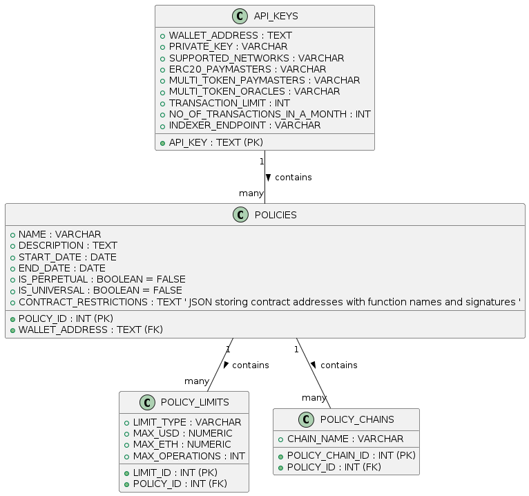

# Arka Sponsorship Policies

Arka needs to have the ability to setup sponsorship policies, these will be offered as a backend API within Arka and this can be consumed by our developer dashboard.

## Reference Create Policy Dashboard

Sponsorship Policies are created for a wallet address (sponsor address)
Policies drive the whether the UserOp should be sponsored 
Constraints for validation is based on policy-configuration params like:

1. A Policy can be perpetual or can have a start and end Dates

2. Policy can be made applicable to selected set of chainIds or have a global applicability for all supported chains for that wallet address

3. 3 Types of Limits can be defined for the Policy:
   - GLOBAL : Limit the total amount of USD or Native Tokens you are willing to sponsor.
   - PER_USER: Limit the amount of USD or Native Tokens you are willing to sponsor per user.
   - PER_OPERATION: Limit the amount of USD or Native Tokens you are willing to sponsor per user operation.

   - For Each LimitType, the LimitValues to be defined are:
 
    - GLOBAL
        1. Maximum USD: The maximum amount of USD this policy will sponsor globally.
        2. Maximum ETH: The maximum amount of ETH this policy will sponsor globally.
        3. Maximum Number of UserOperations: The maximum number of User Operations this policy will sponsor globally.

    - PER_USER
        1. Maximum USD: The maximum amount of USD this policy will sponsor per user.
        2. Maximum ETH: The maximum amount of ETH this policy will sponsor per user.
        3. Maximum Number of UserOperations: The maximum number of User Operations this policy will sponsor per user.

    - PER_OPERATION
        1. Maximum USD: The maximum amount of USD this policy will sponsor per user operation.
        2. Maximum ETH: The maximum amount of ETH this policy will sponsor per user operation.

4. Destination Contract Address & Function Filter 

- A JSON-formatted string that stores an array of objects, each containing a contractAddress and a functionName. 
- This field allows specifying which contract functions are eligible for sponsorship under this policy. 
- The JSON structure provides flexibility and can be easily extended or modified as requirements evolve.

JSON Structure for CONTRACT_RESTRICTIONS
To facilitate effective checks and validations, store both the function name and its signature in the JSON structure:

```json
[
  {
    "contractAddress": "0x123abc...",
    "functions": [
      {
        "name": "transfer",
        "signature": "transfer(address,uint256)"
      },
      {
        "name": "approve",
        "signature": "approve(address,uint256)"
      }
    ]
  },
  {
    "contractAddress": "0x456def...",
    "functions": [
      {
        "name": "mint",
        "signature": "mint(address,uint256)"
      },
      {
        "name": "burn",
        "signature": "burn(uint256)"
      }
    ]
  }
]
```


### DB Design Model


